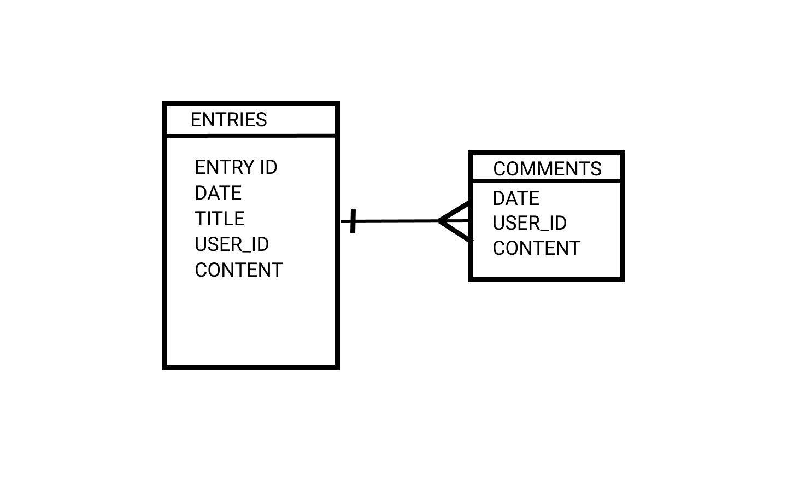

# Impromptu - CRUD Application

## Description

Impromptu is a diary application where users can document their daily feelings.  This helpful for people to look back and reflect on things that may ultimately help them to make better decisions in their life.

## Trello Board

[Link to To Trello Board](https://trello.com/b/q4N2t8xR/build-app)

## Wireframe

[Link to Figma Wireframe](https://www.figma.com/proto/3Hpfy9mio74nxPYU67dxaj/Untitled?node-id=1%3A2&scaling=min-zoom&page-id=0%3A1)

## ERD

