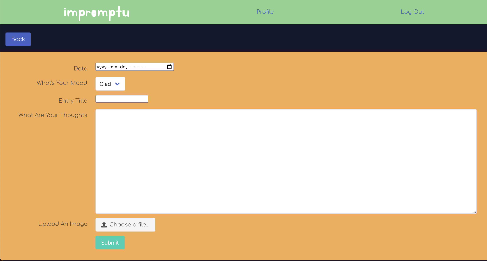
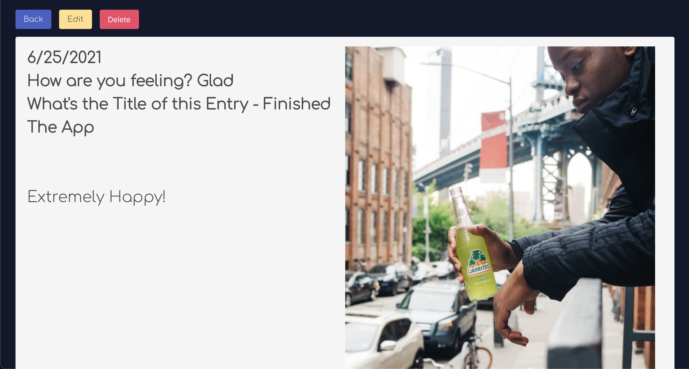

# Impromptu - CRUD Application

## Description

Impromptu is a web application where users can document their daily feelings.  This app is helpful for people to reflect on things that may ultimately help them to make better decisions in their life. When users log in they have the ability to create or comment on other people's posts.

## Screenshots of The App

## Technologies Used

* Node.js
* Express
* Mongoose
* OAuth Authentication
* Bulma

## Trello Board

[Link to To Trello Board](https://trello.com/b/q4N2t8xR/build-app)

## Wireframe

[Link to Figma Wireframe](https://www.figma.com/proto/3Hpfy9mio74nxPYU67dxaj/Untitled?node-id=1%3A2&scaling=min-zoom&page-id=0%3A1)

## ERD

[Link to ERD](https://lucid.app/lucidchart/invitations/accept/inv_1e09ddf6-1542-4239-bd2b-58db112d6ebe?viewport_loc=145%2C21%2C1579%2C835%2ClX5M2rYPdq7w)

## MVP

Deliver a working prototype where people can add text to a post and other users can comment on it.

## Stretch Goal

Give the ability for the user to add different media such as .mp3 and image files.
